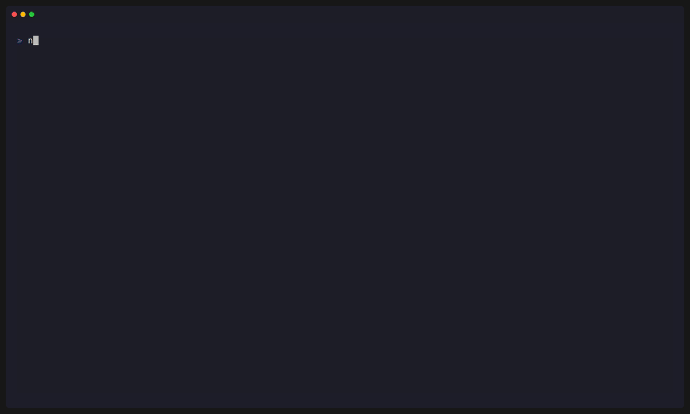

# initmyrepo

[](https://www.npmjs.com/package/initmyrepo)
[](https://github.com/luminescencedev/initmyrepo/actions/workflows/ci.yml)
[](./LICENSE)

```
  ██╗███╗   ██╗██╗████████╗    ███╗   ███╗██╗   ██╗
  ██║████╗  ██║██║╚══██╔══╝    ████╗ ████║╚██╗ ██╔╝
  ██║██╔██╗ ██║██║   ██║       ██╔████╔██║ ╚████╔╝
  ██║██║╚██╗██║██║   ██║       ██║╚██╔╝██║  ╚██╔╝
  ██║██║ ╚████║██║   ██║       ██║ ╚═╝ ██║   ██║
  ╚═╝╚═╝  ╚═══╝╚═╝   ╚═╝       ╚═╝     ╚═╝   ╚═╝

  ██████╗ ███████╗██████╗  ██████╗
  ██╔══██╗██╔════╝██╔══██╗██╔═══██╗
  ██████╔╝█████╗  ██████╔╝██║   ██║
  ██╔══██╗██╔══╝  ██╔═══╝ ██║   ██║
  ██║  ██║███████╗██║     ╚██████╔╝
  ╚═╝  ╚═╝╚══════╝╚═╝      ╚═════╝
```



**Initialize any project -- web, mobile, API, monorepo -- in seconds.**

## Install

```bash
# npx (no install needed)
npx initmyrepo@latest

# Global via npm
npm install -g initmyrepo

# Homebrew (macOS / Linux)
brew tap luminescencedev/tap
brew install initmyrepo
```

## Usage

```bash
# Run the interactive wizard
npx initmyrepo@latest

# Pre-fill the project name
npx initmyrepo@latest my-project

# Jump straight to favorites
npx initmyrepo@latest --fav
```

## Templates -- 25 total

For Vite-based templates (React, Vue, Svelte, SolidJS), the wizard asks you to choose:

- **Language**: TypeScript or JavaScript
- **CSS**: TailwindCSS v4 or Vanilla CSS

### Web (10)

| Template        | Stack                                      |
| --------------- | ------------------------------------------ |
| React + Vite    | React 19 - Vite 6                          |
| Vue 3 + Vite    | Vue 3.5 Composition API - Vite 6           |
| Svelte 5 + Vite | Svelte 5 Runes - Vite 6                    |
| SolidJS + Vite  | SolidJS 1.9 - Vite 6                       |
| Next.js 15      | App Router - TypeScript - TailwindCSS      |
| Astro           | SSG/SSR - TypeScript                       |
| SvelteKit       | SSR - TypeScript - File-based routing      |
| Nuxt 3          | SSR - TypeScript - Auto-imports            |
| Remix           | SSR - TypeScript - Nested routes           |
| TanStack Start  | Full-stack React - TypeScript - tRPC ready |

### Mobile (3)

| Template         | Stack                                    |
| ---------------- | ---------------------------------------- |
| Expo             | React Native - SDK 52 - TypeScript       |
| Expo Router      | File-based routing - iOS / Android / Web |
| React Native CLI | Bare React Native - TypeScript           |

### Backend / API (6)

| Template       | Stack                                     |
| -------------- | ----------------------------------------- |
| Hono           | Ultra-fast - TypeScript - Node / Edge     |
| Fastify        | High-perf - TypeScript - JSON Schema      |
| NestJS         | Enterprise - TypeScript - Modular         |
| Express API    | Minimal REST - TypeScript                 |
| Elysia         | Bun-first - TypeScript - End-to-end types |
| tRPC + Fastify | Type-safe API - TypeScript                |

### Full-stack (3)

| Template          | Stack                                           |
| ----------------- | ----------------------------------------------- |
| T3 Stack          | Next.js - tRPC - Prisma - NextAuth              |
| Better T Stack    | Hono/Elysia - tRPC/oRPC - Drizzle - Better Auth |
| Next.js + Payload | App Router - Payload CMS 3 - PostgreSQL         |

### Monorepo (3)

| Template       | Stack                                  |
| -------------- | -------------------------------------- |
| Turborepo      | Vercel - Next.js + API apps            |
| Nx Workspace   | Plugins for React, Next, Node, Angular |
| pnpm Workspace | Custom - apps/ + packages/             |

## Commands

```bash
# Interactive wizard
initmyrepo [project-name]

# Jump to favorites (use or manage)
initmyrepo --fav
initmyrepo my-project --fav

# List all templates
initmyrepo list
initmyrepo list --category backend

# Manage favorites (list, add, delete)
initmyrepo favorites
```

## Favorites

Save git repository URLs as favorites for quick access.

```bash
# Go straight to favorites
initmyrepo --fav

# Or manage them (list / add / delete)
initmyrepo favorites
```

How it works:

- Choose "Custom URL" in the wizard, paste a git URL, then save it as a favorite
- Give it a name and an emoji icon
- Favorites are stored locally via `conf` (JSON in `~/.config/initmyrepo/`)
- Next time, use `--fav` to jump directly to your saved templates
- From `--fav` you can also choose "Manage favorites" to add or delete entries

## Flags

| Flag    | Description                                  |
| ------- | -------------------------------------------- |
| `--fav` | Skip the wizard and go directly to favorites |
| `-v`    | Show version                                 |

Some templates are marked as "interactive" -- they ask their own setup questions (Astro, SvelteKit, Remix, TanStack Start).

## Development

```bash
git clone https://github.com/luminescencedev/initmyrepo
cd initmyrepo
pnpm install
pnpm build      # compile TypeScript -> dist/
pnpm start      # test the CLI
pnpm dev        # watch mode
```

## Tech stack

- TypeScript 5.6
- [@clack/prompts](https://github.com/natemoo-re/clack) -- interactive prompts
- [commander](https://github.com/tj/commander.js) -- CLI framework
- [execa](https://github.com/sindresorhus/execa) -- run shell commands
- [conf](https://github.com/sindresorhus/conf) -- persist favorites
- [picocolors](https://github.com/alexeyraspopov/picocolors) -- terminal colors
- [tsup](https://github.com/egoist/tsup) -- build tool

## License

MIT © Luminescence Dev — see [LICENSE](./LICENSE)
